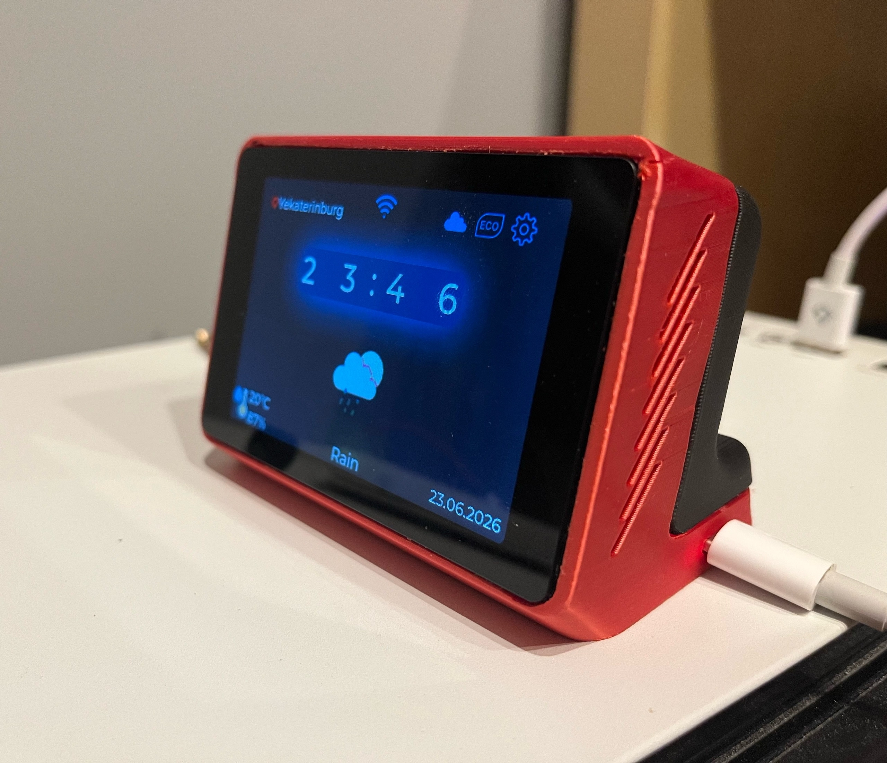

# 🌡️ MeteoNode — Умная Метеостанция

Современная компактная метеостанция на базе **WT32-SC01 Plus (ESP32-S3)** с ярким сенсорным дисплеем, продвинутым интерфейсом и удобным Android-приложением.

## ✨ Основные возможности

- **Высококачественный дисплей** — 3.5" IPS 480×320 с LVGL UI и плавными анимациями
- **Полный набор датчиков**:
  - Температура и влажность (AHT20)
  - Давление и высота (BMP180)
  - CO₂, TVOC, AQI (ENS160)
- **Умная автояркость** + **недельное расписание** яркости по дням
- **Прогноз погоды** на 3 дня (WeatherAPI) с кэшированием
- **Система оповещений** при превышении порогов
- **Wi-Fi** (AP + STA) с удобным captive portal
- **Синхронизация времени** по NTP с автоматическим определением часового пояса
- **Управление одной кнопкой** (клик, двойной клик, длинное нажатие)
- **Мобильное Android-приложение** с реал-тайм статистикой, графиками и настройками

## 🛠 Технические характеристики

## 🛠 Технические характеристики

| Параметр              | Значение                                           |
|-----------------------|----------------------------------------------------|
| Микроконтроллер       | ESP32-S3                                           |
| Дисплей               | 3.5" IPS 480×320, ёмкостный сенсор                |
| Память                | 8 МБ Flash                                         |
| Датчики               | AHT20 (темп.+влажн.), BMP180 (давление), ENS160 (CO₂, TVOC, AQI) |
| Питание               | 5V via USB-C                                       |
| Корпус                | [Написать автору в VK за 3D-моделью](https://vk.com/undervalued1) |

## 📱 Мобильное приложение

**[🔗 Перейти в репозиторий Android-приложения](https://github.com/undervalued1/MeteoNode_MobileApp)**

- Поиск и подключение к устройству
- Реал-тайм мониторинг всех параметров
- Красивые графики с историей
- Настройка пороговых значений
- Управление яркостью и расписанием
- Темы оформления (светлая/тёмная/системная)

## 🚀 Как начать

### 1. Прошивка устройства

1. Открой проект в **PlatformIO**
2. Выбери `wt32-sc01-plus`
3. Загрузи прошивку (`Upload`)

### 2. Первоначальная настройка Wi-Fi

1. Включи устройство
2. Подключись к Wi-Fi сети `MeteoNode-Setup`
3. Открой браузер → перейди по `192.168.4.1`
4. Введи данные своей Wi-Fi сети → сохрани

Устройство перезагрузится и подключится к твоей сети.

### 3. Мобильное приложение

- Установи APK (или собери из исходников)
- Подключи телефон к той же Wi-Fi сети
- Приложение автоматически найдёт устройство

## 📊 Возможности приложения

- **Главная** — текущие показания + прогноз
- **Статистика** — живые графики с анимацией
- **Настройки** — пороги, яркость, расписание, уведомления
- **Погода** — детальный прогноз на 3 дня

## 🔧 Настройки

- **Пороги**: температура, влажность, CO₂
- **Яркость**: дневная/ночная + недельное расписание
- **Уведомления**: о превышении порогов (в разработке)

## 🛠 Разработка

### Библиотеки

- **LovyanGFX** + **LVGL** 8.4
- **ArduinoJson**
- **Preferences**
- **ESPmDNS**, WebServer, DNSServer
- **OkHttp** + Coroutines (Android)

## 🏆 Автор

**undervalued / Ялымов Петр**  
Проект сделан с душой для дома и обучения.

---
